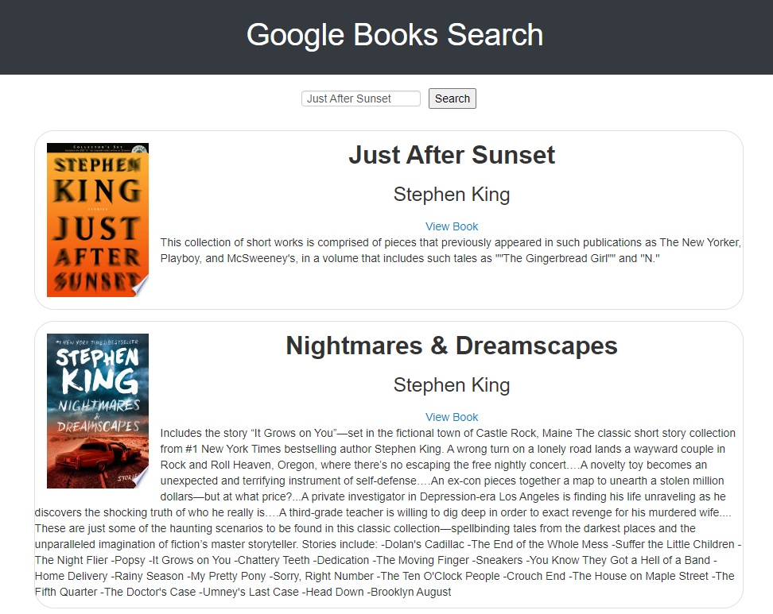

<h1 align="center"> Google Books Search </h1>

## Table of Contents
- [Description](#description)
- [Installation](#install)
- [Deployment](#deployed) 
- [Screenshot](#screenshot)
- [License](#license)
- [Questions](#questions)

## Description
A Google Books Search app created using React, Node, Express, and MongoDB.

## Installation
- npm install
- npm start

## Deployed Site
https://limitless-sea-14002.herokuapp.com/

## Screenshot

## License

## Questions
Github: https://github.com/esober101

Email: ericscottober@gmail.com